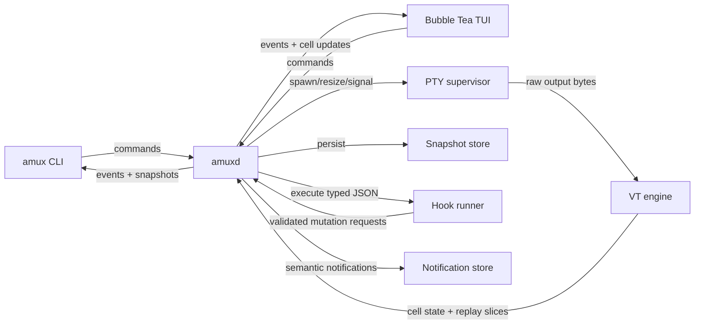

# L1 Architect Handoff — Round 2

- run_id: `run-bc5df50b-2431-46bf-94a0-624f9dd33115`
- loop: `L1`
- lane: `phase:brainstorm`
- role: `architect`
- dispatch: Guild Codex host adapter, read-only inputs, revised brief authored from frozen defaults
- status: `revised`

## Revised bounded brief

Build a clean-room, Linux-first workspace runtime whose core authority is a local Go daemon. The core state model is:

`daemon -> sessions -> workspaces -> split-tree panes -> ordered surfaces`

Each pane has exactly one active surface at a time. Windows are not part of MVP state; they are later client views over the same daemon-owned model. MVP is a real in-process terminal multiplexer TUI, not an external-terminal supervisor: a Go VT parser and cell-state engine sit behind a renderer interface, and Bubble Tea composes the visible split tree. Raw PTY byte streams and bounded replay are protocol truth; no Ghostty dependency and no cgo.

The product goal is a deterministic, inspectable, automation-safe terminal workspace runtime. Clean-room concepts are allowed; original CLI or protocol compatibility with cmux is a non-goal.

## Scope frozen for MVP

### Core runtime

- `amuxd` is the only authority for sessions, workspaces, panes, surfaces, PTYs, snapshots, hooks, notifications, and event cursors.
- `amux` is a CLI and control client over the daemon command surface.
- The TUI is an in-process client using the same daemon command/event protocol as the CLI.
- Surfaces in MVP are terminal-first. The model permits ordered surfaces per pane, but non-terminal surface types are roadmap unless explicitly added later.

### State model

- Sessions contain one or more workspaces.
- Workspaces are repo-agnostic and may declare an optional primary root.
- Panes form a serializable split tree inside each workspace.
- Each pane owns an ordered surface list plus one active surface pointer.
- Each pane has its own cwd; git root discovery is per pane and may differ from workspace primary root.
- Stable opaque IDs exist for session, workspace, pane, and surface records and survive snapshot/restore.

### Terminal model

- PTYs are the source of process truth.
- The VT subsystem parses PTY output into cell state for the TUI and other clients behind a stable interface.
- Bounded raw-output replay is persisted for restore and reattach flows.
- Renderer internals may change later, but PTY bytes, event IDs, and persisted state contracts may not silently drift.

### Persistence and restore contract

Snapshots persist:

- versioned tree state and stable IDs
- pane cwd
- surface argv
- explicit non-secret env allowlist
- restart policy, default `manual`
- bounded raw-output replay
- notification state and read/unread markers
- event cursor

Snapshots never persist:

- stdin boot input
- arbitrary inherited environment
- process memory
- live browser state

Restore is considered usable only when the tree renders and every pane is either:

- attached to a live process
- explicitly restarted by policy or operator action
- visibly stopped with accurate status

### Hooks and trust

- Hooks are typed JSON executables only.
- Hooks are default denied and require explicit project trust.
- Hook env exposure is a minimal allowlist only.
- Secret redaction is mandatory on inputs, logs, and outputs.
- Default timeout is 2 seconds; hard maximum is 30 seconds.
- Output is capped at 1 MiB per execution.
- MVP does not claim OS-level or network sandboxing.
- Every requested mutation is validated by the daemon before application.

### Platform/support boundary

- MVP support targets: Arch Linux reference profile plus glibc Linux `x86_64` and `aarch64`.
- MVP CI includes Arch and one stable mainstream glibc distro.
- MVP packaging includes tarballs and an AUR binary package.
- musl is excluded from MVP.
- Wayland/X11 differences affect only optional desktop notifications in MVP, not terminal correctness.
- Browser, macOS, and Windows are roadmap items after MVP and do not gate MVP completion.

## Components

- `amuxd`: long-lived daemon for PTYs, state mutation, snapshotting, hook execution, event emission, and policy checks.
- `session manager`: creates, lists, and tears down sessions and workspace graphs.
- `workspace graph`: owns split-tree panes, ordered surfaces, active-surface pointers, and stable IDs.
- `pty supervisor`: spawn, resize, signal, reap, and exit tracking for terminal processes.
- `vt engine`: parses PTY output into cell state and exposes a renderer-neutral terminal model.
- `snapshot store`: persists versioned graph state, replay buffers, notification state, and event cursor.
- `event log`: emits monotonic contiguous event IDs and supports bounded replay plus gap recovery.
- `hook runner`: executes trusted typed JSON hooks under timeout, size, env, and redaction limits.
- `cli client`: complete operator control surface for lifecycle, inspection, layout, replay, hooks, and restore.
- `bubble-tea tui`: in-process multiplexer UI for split-tree rendering, focus, resize, attach, replay, notifications, and restart/stop actions.
- `notification store`: daemon-owned semantic notification model with optional Linux desktop delivery adapter.

## Data flow

## MVP acceptance criteria

### Functional acceptance

1. The daemon can create, persist, restore, and destroy sessions containing multiple repo-agnostic workspaces.
2. The TUI renders a live split tree with at least 8 visible panes in one workspace and keeps focus, resize, and redraw behavior correct during active PTY output.
3. Each pane supports an independent cwd, and git root discovery is computed per pane without requiring a workspace-wide repo root.
4. Snapshot restore preserves stable IDs, tree shape, pane cwd, argv, env allowlist, restart policy, bounded replay, notification state, and event cursor.
5. Restore never replays stdin boot input, inherited ambient env, process memory, or browser state.
6. A pane after restore is always in one of three visible states: attached, explicitly restarted, or visibly stopped.
7. Hooks cannot mutate state unless the daemon accepts a valid typed JSON request from a trusted project.
8. Hook executions exceeding timeout, env policy, output cap, or schema validation fail closed and are audit-visible.
9. The CLI covers all 20 required MVP operator flows listed below with passing automated checks.
10. TUI behavior is layered on the same command and event surfaces used by the CLI; no TUI-only state mutations are allowed.

### Required CLI flow coverage

The MVP is not complete unless all 20 of these flows exist in the CLI and pass automated coverage tests:

1. start daemon
2. stop daemon
3. create session
4. list sessions
5. create workspace
6. list workspaces
7. split pane horizontally
8. split pane vertically
9. focus pane
10. resize pane
11. spawn terminal surface
12. attach to pane
13. send input to pane
14. read bounded replay
15. capture inspectable pane state
16. save snapshot
17. restore snapshot
18. explicitly restart stopped pane
19. stop pane process
20. subscribe to events

### Performance and soak acceptance

1. Benchmark results are reported against two fixed profiles:
   - documented 4-vCPU / 8-GiB Linux CI profile
   - documented Arch Linux `x86_64` reference profile
2. Blocking soak: 30 minutes on the CI profile with no daemon crash, no orphaned child process, and no unrecovered event-gap state.
3. Nightly soak: 8 hours on the reference profile with the same pass criteria.
4. Zero sequence gaps means event IDs remain monotonic and contiguous for normal operation; if a gap is detected, the client must recover by snapshot refresh and resume from the new cursor.
5. A gap without automatic recovery is a test failure.
6. Usable restore for benchmark purposes means the workspace tree is visible and every pane is attached, explicitly restarted, or visibly stopped within the restore timeout.
7. Restore of an 8-pane workspace from a clean daemon state completes to usable state within 2 seconds on the reference profile.
8. Split, focus, and resize actions become visible in the active TUI frame and subscribed event stream at p95 under 75 ms on the reference profile.

## Non-functional requirements

1. Authority: all durable state mutation happens in the daemon; clients are replaceable.
2. Determinism: snapshots and events are versioned and sufficient to reconstruct the last persisted graph plus replay state.
3. Safety: hook requests are deny-by-default, validated, bounded, and redacted.
4. Portability: MVP requires glibc Linux only; browser, macOS, Windows, and musl do not distort core design.
5. Operability: every pane and hook state is inspectable from the CLI.
6. Recoverability: snapshot-on-gap recovery is part of the base protocol contract, not an optional best effort.

## Risks and mitigations

| Risk | Why it matters | Mitigation |
|---|---|---|
| VT parser or cell-state drift from PTY truth | The TUI can show incorrect terminal state | Keep raw PTY bytes as protocol truth, test parser correctness against replay fixtures, and treat renderer output as derived state |
| Split-tree plus ordered-surface identity bugs | Restore, focus, and CLI targeting become unstable | Use stable opaque IDs everywhere and snapshot graph invariants in tests |
| Overpromising restore fidelity | Users may infer full process resurrection | Hard-code the restore contract, visibly mark stopped panes, and exclude memory/stdin/browser persistence from docs and tests |
| Hook trust boundary erosion | Hooks become an unbounded execution path into daemon state | Require explicit trust, typed JSON, schema validation, env allowlists, redaction, timeout, and size caps |
| Scope creep toward cmux compatibility | Clean-room velocity is lost to parity chasing | Declare original CLI/protocol compatibility out of scope and reject compatibility work unless re-scoped |
| Linux support matrix sprawl | Packaging and CI work overwhelm the MVP | Limit MVP to Arch reference plus one mainstream glibc distro, tarballs, and AUR binary packaging |
| Event gap handling under load | Clients can drift or hang on stale state | Make contiguous IDs mandatory and require snapshot-on-gap recovery in blocking tests |

## Autonomy for implementation

The implementation team does not need further product approval to decide:

- internal Go package structure
- exact socket framing and command envelope format
- snapshot file layout versus SQLite index split, so long as the persisted contract remains intact
- replay buffer sizing, as long as it is documented and bounded
- Bubble Tea component decomposition and renderer internals
- daemon scheduling/concurrency strategy
- exact Linux desktop notification adapter choice
- exact git discovery implementation, provided it remains per pane

These are implementation choices, not product-definition blockers.

## Final proposed constants

- Second CI/support target: Ubuntu 24.04 LTS on glibc, alongside the Arch rolling reference lane.
- Release restore fixture: 8 simultaneously visible panes, each backed by a PTY workload fixture.
- Replay guarantee: retain at least the most recent 16 MiB of raw PTY output per surface, configurable upward with a documented global storage budget.

These values are part of the draft presented at the user’s spec-approval gate; no implementation work may silently weaken them.

## Remaining truly blocking questions

None inside the draft. The complete set of proposed product and technical defaults requires explicit user approval before planning begins.

## Handoff receipt

- loop_id: `loop-clarify`
- lane_id: `phase:brainstorm`
- round: 2
- role: `architect`
- status: `revised`
- inputs:
  - `.guild/runs/run-bc5df50b-2431-46bf-94a0-624f9dd33115/handoffs/loop-clarify/round-1-architect.md`
  - `.guild/runs/run-bc5df50b-2431-46bf-94a0-624f9dd33115/handoffs/loop-clarify/round-1-researcher.md`
- output:
  - `.guild/runs/run-bc5df50b-2431-46bf-94a0-624f9dd33115/handoffs/loop-clarify/round-2-architect.md`

HANDOFF RECEIPT
